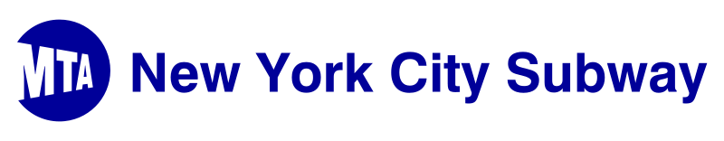
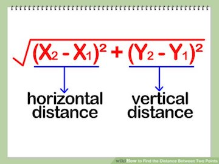

## Author
- Gregory Rankel: [LinkedIn](https://www.linkedin.com/in/gregory-rankel/)  - [Github](https://github.com/gsrankel)




## Problem Statement
Starbucks is a premier international coffee franchise with over 30,000 locations throughout the world. With New York City being one of the top cities to consume coffee, in all of the United States, Starbucks has imprinted its mark throughout the city, opening up more than 400 stores throughout the 5 boroughs, with 240 being specifically in Manhattan.

The Metropolitan Transportation Authority (MTA) has become a very viable and popular means of transportation for people in New York City, seamlessly aiding people in getting to various part of the city that may be too far to walk or too expensive to take a taxi/uber to get too. With this means of transportation, thousands of people go through these arrays of turnstiles which leads to greater foot traffic in these general areas at certain times which would make it prime real estate to open up a Starbucks store. With looking at this turnstile data that the MTA provided, can we identify trends happening around certain subway stations that can possibly lead to expansion opportunities as well as mitigate risk with certain stores that aren’t becoming as popular.

With our search, we will want to be focusing in on the E line to evaluate the best opportunity. The E line was chosen as not only does it cover major parts of manhattan, it also extends throughout queens with the final stop being in Jamaica which is where many people come and transfer to take the air-train to JFK Airport.

We will assess our data with a time series analysis, using historical data of these stations and turnstiles to predict future foot traffic in each of the various locations. We will use both Auto Regression Integrated Moving Average (ARIMA) and the Seasonal Auto Regression Integrated Moving Average (SARIMA) model to evaluate and use regression, specifically Root Mean Squared Error (RMSE), to score our models.


## Executive Summary

When I started off on this project, I knew I had to find two different data sets with one being information on Starbucks store location and one being with MTA Turnstile information. What ended up really happening as I made my way through was that I needed to find a third dataset that I was not expecting to do: a dataset on stations and their locations. By finding this third data set, I was now able to essentially merge my Starbucks Store data with the closest store to these subway stops.

When looking through the original Starbucks data, they had information on Starbucks located all throughout the United States. I first needed to filter through all stores that were just located in New York and knowing that I was going to be focusing in on E line, manually filter through  all the cities that the E runs through to obtain the closest Starbucks. From here, we ran the address through  the googlemaps API and were able to obtain more specific Latitude and Longitude locations that we are able to now use to calculate our distances to the Subway stations.

After filtering out the Subway Stations data with only those with stations along the E line, we were ready to calculate our first, second, and third closest Starbucks stores to each location. To do so, we calculated the Euclidian distance using the Pythagorean theorem with our Latitude being our X coordinates and Longitude being our y coordinates as shown in the image below:



By subtracting both latitude and longitudes, squaring them, adding them together, and finally taking the square root, we came to our metrics of finding the closest store. With this formula as well taking the closest store in order, we were also able to take the second and third closest store as well and then add them to our data frame. The reasoning being that people may look to grab Starbucks at a store that might be closer to their office so we wanted to look at the surrounding area as well.

Our next steps were to get the information we just gathered onto the turnstiles. To do this, we needed to find a way to match the station names up. This ended up requiring a manually entry and matching of each station to each other. To aid in the process, we used the get_close_match function to try and find the similar names of the stations:
```python
get_close_matches('TIMES SQUARE-42ND ST' ,stations['station'].unique(), n=5)
#['TIMES SQUARE-42ND ST', 'TIMES SQUARE']
```
The last thing that we needed to do were get the turns in per day as the turnstiles are a cumulative metric. This metric is running total of turns up until the turnstile resets, in which the counter will restart. To get this, what we had to do was to individually group each stations turnstile individually, take the .max() at the end of the day per the turnstile, less the .min() which represents the cumulative total of the beginning of the day, and get the total of that day. Due to the reset though however, we had to limit to under 30,000 turns as a mean of countering the turnstiles that may of has a reset on a particular day.

The last thing that we needed to do were get the turns in per day as the turnstiles are a cumulative metric. This metric is running total of turns up until the turnstile resets, in which the counter will restart. To get this, what we had to do was to individually group each stations turnstile individually, take the .max() at the end of the day per the turnstile, less the .min() which represents the cumulative total of the beginning of the day, and get the total of that day. Due to the reset though however, we had to limit to under 30,000 turns as a mean of countering the turnstiles that may of has a reset on a particular day.

Some initial findings that we saw were that along the E line, we found that the most turnstiles were happening at both Port Authority as well as Penn Station as these are two main stations where a lot of travelers from both Long Island and New Jersey come in. This led us to choosing Port Authority as our first station so we can examine and see if we are able to predict on a high traffic area. Other finding’s we saw that the most turnstiles that were happening outside of Manhattan were happening at Jackson Heights. This is an express stop on the station that we assume has a lot of foot traffic due to the more people possibly choosing this stop rather than heading to a closer stop that may be local.

Based on the distance metric we used to calculate how far stores are from certain stations, I decided to take the product of all three as a means of better gaging the area around and how many stores are nearby. This would show me that if there was an area with a higher product number, that there are less stores opened around that area and we would like to see if there would be a station high on both these charts. We found when calculating this that the station with the farthest product of Starbucks distance would be an area for a possible store. What we discovered was that the that station with the highest distance product was actually Jackson Heights. This was a surprising find for me as for an area that does have the most turnstiles should have more stores nearby you would expect. This then led me to want to do a deeper dive into if there was an opportunity to predict a positive trend in turnstiles at this station.


## Provided Data

 - [Starbucks Dataset](https://www.kaggle.com/starbucks/store-locations/data)
 - [MTA Turnstiles Dataset](https://www.kaggle.com/new-york-state/nys-turnstile-usage-data)
 - [MTA Station Entrances Dataset](http://web.mta.info/developers/data/nyct/subway/StationEntrances.csv)

##  Data Dictionary


|Feature|Type|Description|
|---|---|---|
|**C/A**|*object*|Control Area name/Booth name. This is the internal identification of a booth at a given station.|
|**UNIT**|*object*|Remote unit ID of station|
|**SCP**|*object*|Subunit/Channel/position represents a specific address for a given device|
|**Station**|*object*|Name assigned to the subway station by operations planning.|
|**Line Name**|*object*|Train lines stopping at this location. Can contain up to 20 single character identifier. When more than one train line appears, it is usually intercepting train lines, in major stations where the passenger can transfer between any one of the lines.|
|**Division**|*object*|Each section of the system is assigned a unique line name, usually paired with its original operating company or division (Brooklyn– Manhattan Transit Corporation (BMT), Interborough Rapid Transit Company (IRT), and Independent Subway System (IND).|
|**month**|*object*|Month of year that individual turnstile data is related too.|
|**day**|*object*|Day of Week that individual turnstile data is related too.|
|**Station_Latitude**|*float*|Latitude coordinates of station |
|**Station_Longitude**|*float*|Longitude coordinates of station|
|**first_closest**|*float*|Distance of the first closest store|
|**first_closest_store**|*object*|Name of the first closest store|
|**second_closest**|*float*|Distance of the second closest store|
|**second_closest_store**|*object*|Name of the second closest store|
|**third_closest**|*float*|Distance of the third closest store|
|**third_closest_store**|*object*|Name of the third closest store|
|**Entries**|*int*|number of entries at that turnstile|
|**Exits**|*int*|number of exits at that turnstile|
|**total_turns**|*int*|combined entries and exits at that turnstile|
|**avg_distance**|*float*|The first, second, and third closest numbers multiplied together|


## Conclusion and Next Steps:
In our conclusion, we can say that although our model is predicting like we wanted too on both stations in which we didn't expect to see much of a change in our predictions vs our actual for Port Authority and we we had a positive trend in our model for Jackson Heights, this model still needs more data to ensure its accuracy over a longer period of time. We were able to see by our residuals and predictions that for the most part, our model was tending to predict on the more conservative side in which we some of the actual data tended to be a little more volatile but we were able to see clear and obvious trends that showed that there are positive trends in our dataset.

Even with limited data, I would still recommend Starbucks to look into that area as a means of possible expansion. Unlike what we saw for Port Authority, our SARIMA model for Jackson heights did show an positive trend with its predictions to give us hope that with this information along with seeing that there were not a lot of Starbucks that were close by, hope that it could be a target area. Other findings that we saw would be that the best time, if they were to proceed, would be to look at openings more in the fall as 3 of the top 4 months seem to come at the end of the year as well as Wednesday being the day to open as it showed to be the day that did have the most foot traffic happening during the week.

Moving forward I would like to try to fit this model on the next several stations such as Court Sq and Queens plaza. Both of these stations, from the information that we were able to gather, have promise in being another up and coming area. These are also two stations that seems to have fewer Starbucks within the area. From seeing trends in the past few years these are stations that are located within Long Island City which has seen a spike in real estate prices and could prove to be a great opportunity.

Another step I would like to look at going forward would be to test this over the other three quarters of the year granted that we only really had analysis on October, November and December and used that into predicting January and February. With that problem, we saw certain residuals on which our model was over predicting because it doesn't know how to exactly handle holidays yet because its never seen it before on a prior year. If we were to have several other years of data, I believe that eh model would be able to pick up on this trend happening and give a more accurate prediction into those certain days where there are less people going through turnstiles during different points in the year.
